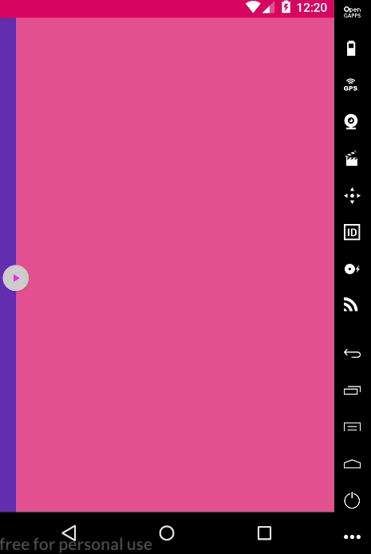

# Example

It is um simple example using react native gesture handle, for capture gesture into screen. And do animate with react native Animated API. She not use native driver, but animates only the property width, height and border that not influence in performance.

